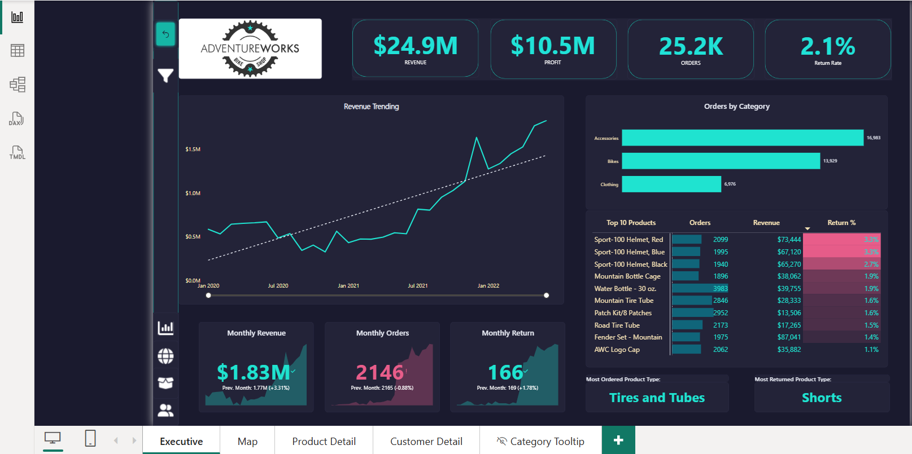
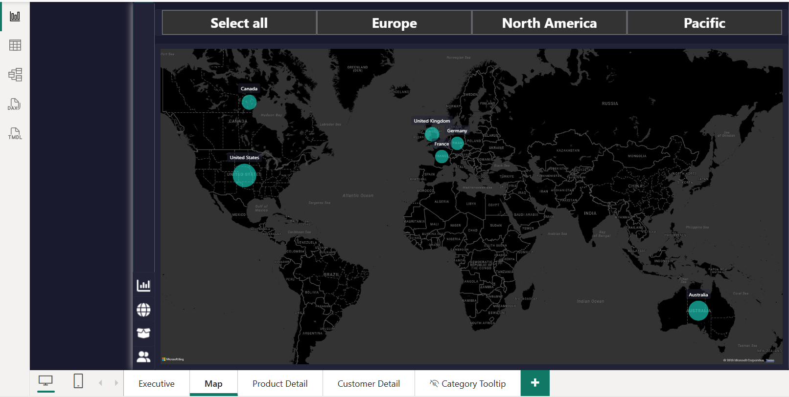
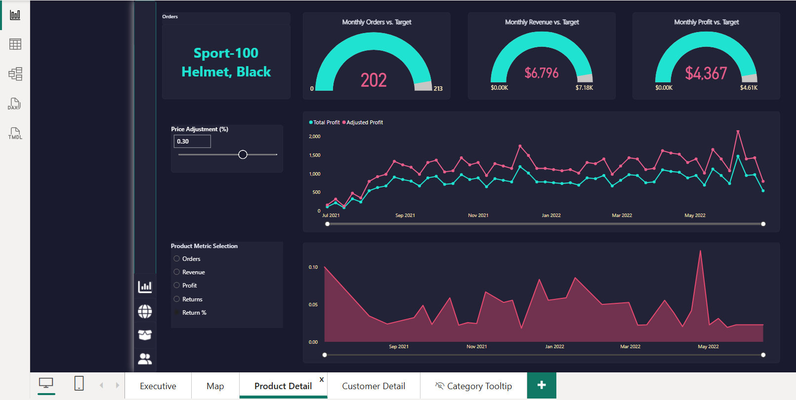
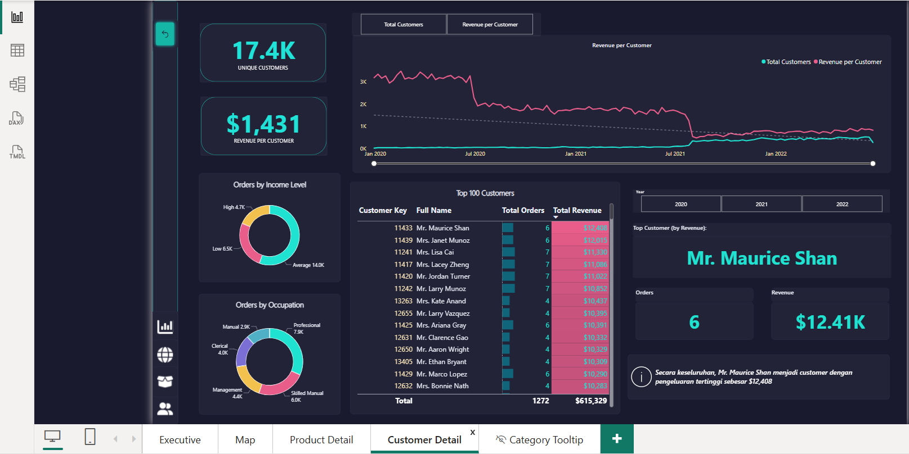
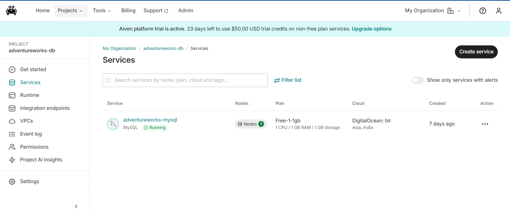
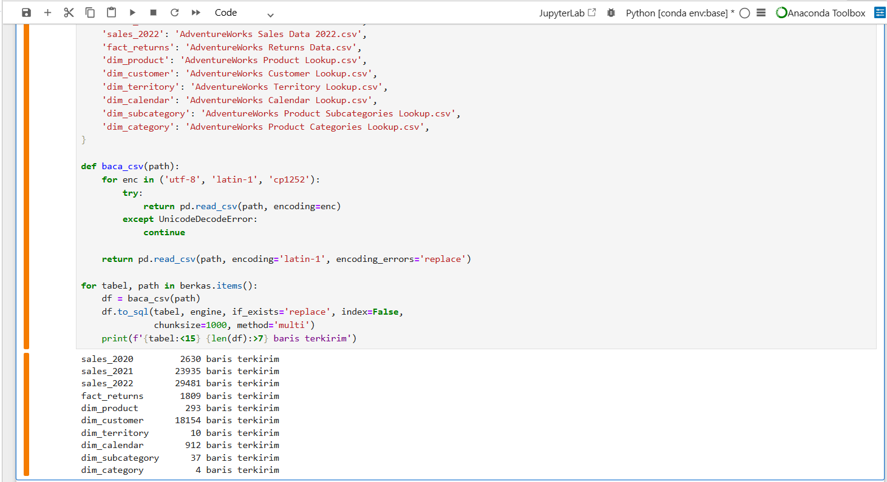
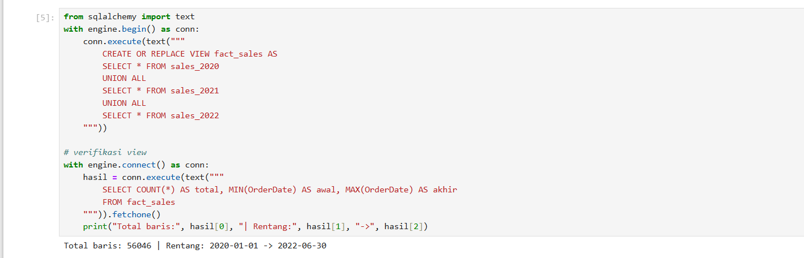
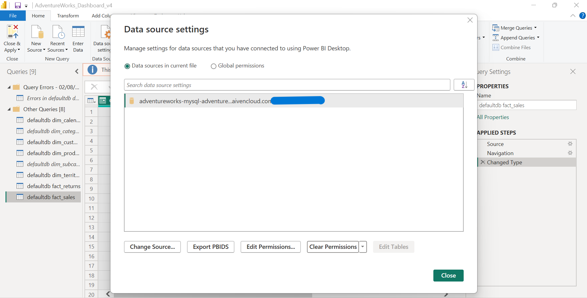
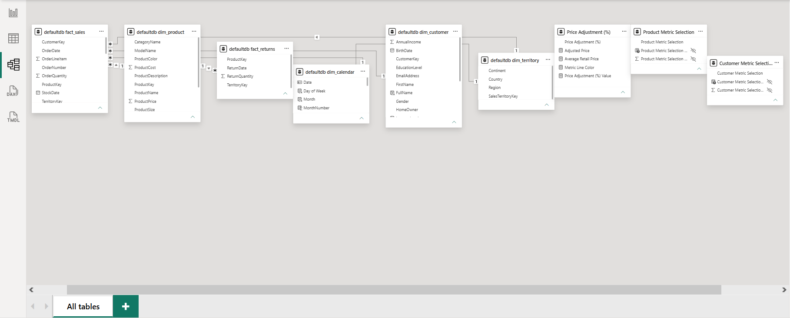

# AdventureWorks — Sales & Customer Intelligence Dashboard

An end-to-end Power BI project built on a real cloud data pipeline — from raw CSV files to a star-schema model with 20+ DAX measures across four interactive report pages.

This project recreates a professional retail analytics dashboard for the AdventureWorks bike shop, owning **every layer** of the workflow: data ingestion, cloud database modeling, and dashboard design — not just the visuals.

---

## 📊 Dashboard Preview


| Executive | Map | Product Detail | Customer Detail |
|-----------|-----|----------------|-----------------|
|  |  |  |  |

---

## 🔧 Data Pipeline

This dashboard is powered by a full end-to-end pipeline — not local files. Data flows from raw CSVs, through a cloud database, into a modeled Power BI report.

```
Raw CSV  →  Python (pandas + SQLAlchemy)  →  MySQL on Aiven  →  SQL view  →  Power BI star schema  →  Dashboard
```

### 1. Cloud Database (Aiven MySQL)

A MySQL database deployed on Aiven (DigitalOcean, Bangalore region), running live on the free tier. All AdventureWorks data lives here — in the cloud, not on a local machine.



### 2. Data Ingestion (Python)

Ten raw CSV files loaded into the cloud database using **pandas + SQLAlchemy**, with an encoding-fallback helper to handle messy source files. The output confirms every table uploaded successfully — 56,000+ sales rows in total.



### 3. SQL Modeling

A SQL view unions three years of sales (2020–2022) into a single fact table — **56,046 rows** spanning Jan 2020 to Jun 2022 — verified programmatically.



### 4. Power BI Connection

Power BI connects **directly to the cloud MySQL server** (Import mode). The data source points to the Aiven host, confirming the dashboard is powered by a real database pipeline — not local CSVs.

> _Connection string redacted for security._



### 5. Star-Schema Data Model

The final model: one fact table linked to product, customer, territory, and a marked date table, plus parameter tables for the interactive features. **7 single-direction relationships.**



---

## ✨ Key Features

- **Four report pages** — Executive overview, geographic Map, Product Detail, Customer Detail
- **Custom dark navy-teal theme** — a hand-built theme distinct from any template
- **Time intelligence** — Revenue LY / YoY %, previous-month deltas, targets, and a 90-day rolling profit measure
- **Custom date hierarchy** — Year → Month → Week → Date drill-down on calculated calendar columns
- **Field parameter** — a metric selector that swaps the visualised measure and recolors the line dynamically via DAX
- **What-if analysis** — a price-adjustment slider (numeric parameter) driving an Adjusted Profit measure
- **UX polish** — cross-page drill-through, bookmark reset buttons, a slide-in slicer panel, and custom tooltips

---

## 🛠️ Tech Stack

| Layer | Tools |
|-------|-------|
| **Ingestion** | Python (pandas, SQLAlchemy, PyMySQL) |
| **Database** | MySQL on Aiven (cloud) |
| **Modeling** | SQL, Power BI star schema |
| **Analysis** | DAX (20+ measures) |
| **Visualization** | Power BI Desktop |

---

## 📈 Data Overview

| Metric | Value |
|--------|-------|
| Total revenue tracked | $24.9M |
| Sales records | 56,046 |
| Unique customers | 17.4K |
| Date range | Jan 2020 – Jun 2022 |
| Report pages | 4 |
| DAX measures | 20+ |

---

## 🧹 Data Engineering Notes

Beyond loading and modeling, this project handled real-world data quality work **at the database level**:

- Cleaned malformed export rows (footer metadata) that broke type conversion
- Converted key columns from text to integer types
- Added primary keys to every large table to satisfy cloud-database integrity requirements

Cleaning at the source layer — not just in the BI tool — keeps the model reliable and the pipeline reproducible.

---

## 📂 Repository Structure

```
├── notebooks/
│   └── upload.ipynb          # CSV → MySQL ingestion + SQL view
├── images/                   # Pipeline & dashboard screenshots
├── AdventureWorks_Dashboard.pbix   # (optional) Power BI file
└── README.md
```

---

## 👤 About

Built by **Della** — transitioning into data analytics with a background in Food Science & Technology. This project demonstrates end-to-end ownership of an analytics workflow, from raw data to a polished, interactive product.

- 🔗 Portfolio: _[https://drive.google.com/file/d/1qb5p6y8_gDfU7ku81kTmvm9_PBPE-OBV/view?usp=sharing]_
- 💼 LinkedIn: _[https://www.linkedin.com/in/della-rahmadani00/]_
- 📧 dellarahmadani343@gmail.com

---

_AdventureWorks is a sample dataset provided by Microsoft for learning and demonstration purposes._
